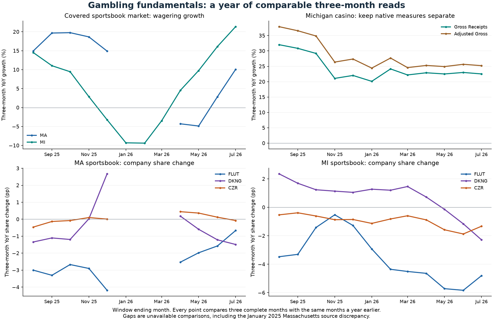

# Monthly gambling fundamentals review — July 2026

**Prepared September 12, 2026.** Main comparison: May–July 2026 versus May–July 2025. Historical display: twelve month-end reads from August 2025 through July 2026.

**Research conclusion:** covered sportsbook demand grew faster, but all three selected companies lost wagering share in Massachusetts and Michigan. Michigan casino growth remained strong and broadly steady. The evidence supports stronger covered-market activity; it does not establish better company profitability.

## Is the covered industry improving?

| Measure | Latest three-month YoY growth | Preceding three-month YoY growth | Change in growth rate |
| --- | ---: | ---: | ---: |
| MA online wagering | +10.1% | -4.3% | +14.37 pp |
| MI online wagering | +21.3% | +4.6% | +16.78 pp |
| MI casino Gross Receipts | +22.5% | +22.9% | -0.38 pp |

The preceding comparison is February–April 2026 versus February–April 2025. This compares year-over-year rates across distinct three-month windows; it is not a seasonally adjusted estimate or proof of durable demand. Sports schedules, including the 2026 World Cup, can affect activity; this review does not isolate that effect. MA and MI are kept separate because their native wagering definitions differ.

## Which companies are gaining ground?

| Covered company operations | MA wagering-share change | MI wagering-share change | MI casino Gross Receipts growth | MI casino share change |
| --- | ---: | ---: | ---: | ---: |
| FLUT | -0.67 pp | -4.81 pp | +17.1% | -1.13 pp |
| DKNG | -1.49 pp | -2.28 pp | +6.8% | -2.02 pp |
| CZR | -0.08 pp | -1.33 pp | -3.0% | -1.63 pp |

**FLUT:** wagering increased in both covered states and Michigan casino receipts grew. Against that, FanDuel lost share in all three comparisons. Its July-only Massachusetts share gain therefore does not establish a sustained gain across May–July. Flutter International is outside this panel.

**DKNG:** wagering and Michigan casino receipts grew, but more slowly than the respective markets. The share losses are evidence against an improving competitive-position thesis in these markets. Golden Nugget and other company activity are outside this native-brand panel.

**CZR:** Massachusetts wagering grew 7.5%, but Michigan wagering fell 7.0% and combined Michigan casino receipts declined. All three share comparisons weakened. Michigan now uses the reviewed Grand Traverse sportsbook operation and Grand Traverse plus Sault casino operations, with explicit ownership boundaries. These digital observations cannot describe Caesars' land-based group.

## Did gross outcomes improve?

| Company | MA gross hold | Change from prior year | MI gross hold | Change from prior year |
| --- | ---: | ---: | ---: | ---: |
| FLUT | 11.41% | -1.03 pp | 14.82% | -1.73 pp |
| DKNG | 10.74% | -1.20 pp | 11.71% | -0.32 pp |
| CZR | 8.65% | +1.43 pp | 7.20% | +1.24 pp |

Gross hold is reported gross revenue divided by wagering, using sums across the full window. It can change with sports results, bet mix and other factors. It is not net revenue margin, retention, promotional efficiency or EBITDA. Adjusted casino receipts remain a separate series in the notebook.

## What changed from the preceding monthly read?

| Covered market | Three-month YoY rate at June end | At July end | Change |
| --- | ---: | ---: | ---: |
| MA wagering | +2.9% | +10.1% | +7.22 pp |
| MI wagering | +16.1% | +21.3% | +5.24 pp |
| MI casino Gross Receipts | +23.0% | +22.5% | -0.48 pp |

Both endpoints are recomputed from the same September 12 retained capture. This is a change in the measured rolling window, not a claim about what information was publicly available in June or July, and not a backtest.

## Does that translate into better company economics?

The dated Q2 issuer evidence tempers a broad improvement claim: Flutter US revenue fell 6% and adjusted EBITDA fell 70%; DraftKings Sports Consumer Volume rose 14.5% while revenue fell 4.6%; Caesars Digital revenue rose 2.3% while adjusted EBITDA fell 15%. These April–June issuer measures cover different businesses and a different period from the state May–July windows. They illustrate why activity, gross outcomes, promotions and earnings must be assessed separately. See the [retained company and legal context](company_context_20260912.md) for the primary releases, definitions and explicit interpretations.

New Jersey and Illinois taxes remain relevant operating-cost context, and the Nevada prediction-market ruling remains jurisdiction- and procedural-stage-specific. No company profit effect has been estimated from those events.

## What remains uncertain, and what should happen next?

1. **Check persistence in the next complete month.** Look for continued market growth together with stabilizing or recovering company share. That would strengthen the case for company improvement; continued share loss would weaken it.
2. **Resolve the specific historical discrepancy.** January 2025 Massachusetts online handle differs by $0.90 between tables in the same source. Current January 2026 amounts remain visible, but dependent YoY/hold comparisons and January–March 2026 rolling-handle comparisons are unavailable. The latest three-month window is unaffected.
3. **Respect ownership history.** Caesars Michigan casino requires both reviewed licenses and starts in July 2024. The August 2025 rolling-three-month comparison crosses that boundary in its prior-year window and remains unavailable. No historical amount is backfilled or relabelled in the database.
4. **Review economics with the next issuer update.** Compare net revenue margins, promotions and tax costs with the direction of activity and share; keep International and land-based operations separate. Recheck legal developments and company ownership when updating sources.
5. **Expand coverage only to answer an exposed gap.** MA/MI and a separate NY weekly view do not establish a national trend. New Jersey is contextual evidence here, not an added component of an industry index.

## Evidence and reproducibility

Start with [notebook 94](../notebooks/94_gaming_industry_update.ipynb). It displays monthly inputs, fixed rolling windows, source gaps, gross hold, native definitions, ownership scope and the separate New York weekly panel. The [workflow guide](industry_workflow.md) explains capture and explicit snapshot selection.

The first review uses 19,806 retained observations in `refresh_20260912T201854Z`, captured September 12 at 20:21:10 UTC. No state collector was rerun for this review. Nine new primary context documents were retained, and the existing Flutter release reused.

Independent verification matched 768 monthly/three-month window comparisons, their nine numerical fields, 32 latest assessments and 192 hold windows. [Operating and mapping source receipt](monthly_fundamentals_sources_20260912.json); [issuer and legal source receipt](company_context_sources_20260912.json).

Database SHA256: `751e135c083f66d025ca4d03116021215ac136518ba24b2093f135af044df3ee`.
