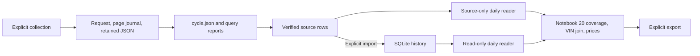

# Read the vehicle research code from one listing

The first question is: **within the same selected Carvana searches, what changed
in visible inventory and asking prices?** The next is whether those observations
help investigate possible retail sales. You can answer the first without assuming
that every disappearance is a sale. Start with the listing evidence; a sales
estimate needs additional evidence and explicit assumptions.

## 1. Know what was selected

An *inventory* is the set of listings returned by a search. A *query* fixes filters
such as make, model, model year and ZIP. A *panel* repeats the same queries over
time. Completing a query means collecting and reconciling its declared pages;
it does not establish coverage of all Carvana vehicles nationwide.

These three populations have different jobs. Do not combine their counts:

| Selection | Where it is defined | What it supports |
| --- | --- | --- |
| Original seven-query Tesla Model 3 daily panel | [daily tracking settings](../config/carvana_daily_tracking.json) and [queries](../config/carvana_daily_pilot.json); Notebook 20's default | Inventory and asking-price comparisons on compatible complete dates. |
| Frozen 32-VIN status study | [study plan](../data/experiments/sales_method_20260912/study/plan.json); Notebook 24's default | Follow-up website outcomes for the selected vehicles and fixed windows. It is a sample from an inventory comparison. |
| Broader 101-query panel | [proposed tracking settings](../data/experiments/mvp_completion_20260912/scale_acceptance_20260912/config/proposed_daily_tracking.json) | A separately selected operating population. The earlier 10,000-VIN scale trial is capacity evidence; it is not this panel's daily baseline. |

*Native* means reported by the source before our interpretation.
An **asking price** is the advertised price, not the amount a buyer paid.
`isPurchasePending` is a native source flag, not proof of a completed purchase.
A **disappearance** means a previously observed identity was absent from a later
complete comparable collection. A native **Sold** label is a website observation;
it does not establish the transaction amount or delivery date. An economic sale
and a reported quarterly unit total are further quantities to validate.

## 2. Open one real retained file

Open this [September 11 projection](../data/experiments/carvana_daily/2026-09-11/attempt_0001/tesla_model3_2024/raw/3cdff3a5f1dbed578eab0e9d7282a3b9c230fd71d69095a2a6261d62c1e09cd8.json)
and search for VIN `5YJ3E1EA0RF732049`, listing `4736254`. It records an asking
price of **$33,590**, pending **false**, at **2026-09-11T10:53:30.283953+00:00**.
The VIN identifies the physical vehicle; the listing ID identifies its retailer
advertisement. Keep the retailer in either identity.

The surrounding retained directory has these actual components:

```text
carvana_daily/2026-09-11/
  cycle.json
  attempt_0001/tesla_model3_2024/
    run_report.json
    attempts/            request/page checkpoints
    response_sources/    retained public response evidence
    raw/                 selected projections, including the linked JSON
    vehicle.sqlite       this query's normalized captures and observations
```

The tracking configuration names a separate combined history,
`data/analysis/carvana_daily/history.sqlite`. Its `cycles.json` register selects
which retained cycle represents each date; the register is not the observations.

The [query report](../data/experiments/carvana_daily/2026-09-11/attempt_0001/tesla_model3_2024/run_report.json)
links the pages and their hashes. Its parent [cycle report](../data/experiments/carvana_daily/2026-09-11/cycle.json)
binds the requested queries, date, observation window and request budget.
`response_evidence.source_path` points from the projection to the earlier retained
source. Here that source is selected public JSON: omitted fields and the original
HTTP serialization are unavailable. A file named `raw` is not automatically a
complete original response.

[search.py](../src/vehicle_tracker/search.py) builds a request with
`build_search_request`, selects public fields with `project_response`, and parses
the projection with `parse_search_capture`. For this vehicle, source `price.total`
becomes `asking_price_usd`; native `isPurchasePending` becomes `purchase_pending`.
Missing values stay missing. Native `previousPrice`, when present, is not a
separately collected earlier snapshot.

## 3. Learn the row grain and identifiers

*Grain* means what one row represents. A *key* identifies that row. A VIN appearing
on two dates is two observations of one vehicle, not a duplicate to delete.

| Identifier | Meaning |
| --- | --- |
| `query_id` | Name of one filter definition in a plan, such as `tesla_model3_2024`. |
| `run_id` | One execution of that query across its pages. A later execution has another ID. |
| `capture_id` | SHA-256 hash of retained capture JSON (projection or failed-capture record); it identifies exact source bytes. |
| `cycle_id` | One explicitly selected collection date/window containing the query runs. |
| `scope_id` | Fingerprint of the query definitions, endpoint and sort. It prevents unlike populations being silently compared. |
| `retailer`, `listing_id`, `vin` | Advertisement identity and physical-vehicle identity. A new listing ID does not erase the vehicle's prior observations. |

These six core contracts are on the Notebook 20 route. The first three are SQLite
tables in the explicitly imported history; the last three are pandas results.

| Table | One row and key | Read these fields before using it |
| --- | --- | --- |
| `query_runs` | One retained query execution; `run_id`. | `context_json`, `query_complete`, `reported_total`, `stored_rows`, observation interval, report hash. |
| `captures` | One retained page capture; `capture_id`, linked to `run_id`. Failed retained captures can have no admitted observations. | `page`, `status`, `row_count`, `source_path`, observation and evidence-availability clocks. A request without retained source remains a checkpoint, not an invented capture. |
| `observations` | One parsed listing in one capture; `(capture_id, retailer, listing_id)`. | `vin`, `observed_at_utc`, asking price, native fields and `run_id`. The daily reader adds `cycle_id` and `source_path`. |
| `daily_cycles` | One selected cycle; `cycle_id`; selected local dates must be unique. | `scope_id`, `coverage_complete`, reason, actual observation interval, target window and `available_at`. |
| `daily_events` | One tracked `(retailer, vin)` per selected `cycle_id`, including absence rows after first observation. | `observed_in_cycle`, `event_type`, prior identity, absence streak and timing uncertainty. An absence row carries last-seen evidence; it is not a new source observation. |
| `daily_identity_join` | One `(retailer, vin)` across the selected before/after pair; an outer join. | `_merge`, before/after listing IDs, prices and source references. `both` is matched; `left_only` disappeared; `right_only` was added. |

Notebook 20 also exposes `observed_vin_history` (one retailer/VIN),
`first_observed_cohorts` (one retailer/first-observed local date), and
`observed_history_memberships` (every selected source observation with its cycle
context). These presence-only tables include valid rows from partial collections.
They do not infer absences, continuous days on market or new listings. A known VIN
keeps its earlier first sighting across relistings or scope changes when that
earlier evidence is selected. Different context prices remain in the membership
rows; the summary selects no representative price. A narrower evidence selection
may have a later first sighting. The separate matched-price age analysis below
continues to use its explicitly labelled complete-collection history.

There are also different clocks. `observed_at_utc` is the source observation time.
`evidence_available_at_utc` records when retained page evidence became available;
the cycle's `available_at` follows its required evidence. `imported_at_utc` records
the explicit database import, not another sighting of the vehicle. `as_of` is the
analysis cutoff: evidence observed or available later cannot be used to reconstruct
what was known then. Reloading a file does not update these clocks. Replay uses the
current parser; reproducing an older published vintage also requires its saved
code and configuration hashes.

## 4. Follow the functions, then the notebook calculation



1. **Choose settings.** [daily.py](../src/vehicle_tracker/daily.py)
   `tracking_settings` resolves a tracking file's plan and storage paths.
   `run_tracking` previews by default. Its deliberate collection/import/refresh
   actions are called by [run_carvana_daily.py](../scripts/run_carvana_daily.py).
2. **Collect and retain, when separately authorized.** [cycles.py](../src/vehicle_tracker/cycles.py)
   `collect_cycle` freezes the scope/window and shares a `CycleBudget`.
   Each request is durably reserved and counted before transport; only its pending
   flag clears after durable response evidence. An uncertain request remains counted
   and cannot be assumed unused or automatically retried.
   [search_plan.py](../src/vehicle_tracker/search_plan.py) `collect_plan` loops over
   queries; `search.collect_search` handles pages. [search_evidence.py](../src/vehicle_tracker/search_evidence.py)
   `retain_response_evidence` retains allowed public evidence before projection;
   `verify_response_evidence` checks it. Clearing pending certifies neither parsing nor coverage.
3. **Reopen evidence.** [history.py](../src/vehicle_tracker/history.py)
   `read_query_evidence(report)` returns **`(run, captures, observations)`**:
   one metadata dictionary and two DataFrames. It verifies source hashes, request
   context, page counts, identities and clocks. `import_reports` is an explicit
   write; `read_history` opens SQLite read-only.
4. **Assemble dates.** `cycles.read_cycle_history(paths, database=None, as_of=...)`
   returns **`(days, rows)`** from verified retained sources. Supplying an existing
   database also reconciles its selected rows to those sources.
   `daily.tracking_history` uses the explicitly registered cycles instead of an
   ad hoc list. SQL row order is unspecified; compare by keys, not row position.
5. **Calculate.** [events.py](../src/vehicle_tracker/events.py) `vin_events` follows
   each VIN through presence, disappearance and reappearance. `daily.daily_tables`
   builds the calendar and analyst tables. In [Notebook 20](../notebooks/20_carvana_history_analysis.ipynb),
   read `daily-comparison-eligibility` before `daily-vin-join`, then
   `daily-asking-prices` and the composition/price bridge. The visible pandas
   calculations are the place to inspect the denominator and arithmetic.
6. **Export deliberately.** `daily.export_tracking` saves daily CSVs and a manifest.
   [export_sales_proxy.py](../scripts/export_sales_proxy.py) runs a saved notebook
   offline, then publishes its tables with source and output hashes.

The daily `vehicle_observations` output contains the admitted source rows plus
date/coverage diagnostics. `daily_inventory` contains one calendar date per row:
`observed_vins` says what was seen, including partial collection;
`inventory_count` is available only for a complete valid date. Missing dates
remain visible. Additions and disappearances require consecutive complete dates.

## 5. Reproduce one inventory and pricing comparison

Use Notebook 20's ordinary settings for the retained September 11/12 pair:

```python
RETAINED_CYCLES = [
    ROOT / 'data/experiments/carvana_daily/2026-09-11/cycle.json',
    ROOT / 'data/experiments/sales_method_20260912/inventory/cycle.json',
]
RETAINED_DATABASE = None
ANALYSIS_CUTOFF = '2026-09-12T14:22:50.159714+00:00'
EXAMPLE_IDENTITY = dict(retailer='carvana', vin='5YJ3E1EA0RF732049', listing_id='4736254')
```

Restart the kernel and run all. This selects sources without importing them.
The dates are complete, share the same seven-query scope and have unambiguous
identities. The selected populations have **706 before and 721 after**:

```text
657 matched + 49 disappeared = 706 before
657 matched + 64 added       = 721 after
706 + 64 - 49               = 721
```

All **657 matched VINs** have both asking prices. Five prices fell, none rose,
and 652 were unchanged: **5 / 657 × 100 = 0.761%** cut frequency. The five cuts
are $600, $600, $400, $400 and $600; their median is **$600**. The matched mean
change is **−$2,600 / 657 = −$3.96**. The denominator is matched VINs with known
prices, not all 721 ending listings and not the five cuts.

The whole-inventory mean rose from **$28,371.30 to $28,474.60**. That can coexist with
falling matched prices because additions and disappearances change the vehicle mix.
The bridge separates repricing of matched vehicles from composition.
Days since first observed is also not the vehicle's true listing age.

For the traced VIN, the [September 12 projection](../data/experiments/sales_method_20260912/inventory/attempt_0001/tesla_model3_2024/raw/fbb8a110662061bf7e1963213043716f88663f416dd9761063e647f5750a3aea.json)
still shows **$33,590**, so the price change is **$0**. Pending changed from false
to true. This is a native-status change while still listed, not a confirmed sale.
Use `daily-source-trace` through `daily-source-calculation` to inspect both sources.

## 6. Keep the hard checks close to the evidence

Collection/reader modules own hash, source-contract, identity, pagination and
clock checks so every notebook uses the same admission rules. Cycle and daily
readers assess scope/date coverage and source/SQLite agreement. Notebook
calculations expose joins, groupings, denominators and assumptions after those
checks. Do not replace a failed check with `drop_duplicates`, zero filling or a
different source selection just to obtain an answer.

[sales.py](../src/vehicle_tracker/sales.py) `sale_candidates` groups qualifying
persistent absence into episodes, records reappearance and attaches explicit
analyst reviews. The default three-complete-absent-date rule creates a candidate,
not a sale. [sales_proxy.py](../src/vehicle_tracker/sales_proxy.py) is a specialist
toolbox for inventory/native events, interval allocation and conditional cohort
estimates; it supplies no automatic national sales conversion.

[status_experiment.py](../src/vehicle_tracker/status_experiment.py) `read_experiment`
and `score_plan` keep the frozen study and its first matched endpoint in each
window. A study *arm* is an observational comparison group, not randomized treatment.
`primary_outcome='pending'` means a study check is awaited, not that the vehicle's
source `isPurchasePending` flag is true. Native Unavailable can be identity matched
while still unresolved for the Sold/Available endpoint. Notebook 24 explains why
**4/(4+1)=80%** among resolved checks differs from **40–90%** bounds on ten selected VINs.

For quarterly work, [expectations.py](../src/vehicle_tracker/expectations.py)
`quarter_coverage` shows usable calendar coverage; `forecast_review_rows` compares
saved forecasts with explicitly supplied results. A forecast must be saved before
the result's `first_published_at`; `available_at` selects a known revision.
Unknown publication time leaves accuracy unscored. Empty forecasts mean no estimate,
not zero sales. Notebook 30 keeps assumptions and labelled synthetic arithmetic separate.

## 7. Know what to edit and where to return

Edit ordinary notebook settings for source selection, cutoff and example identity;
restart the kernel when changing populations. Forecast assumptions and review
records are explicit analyst inputs. The `*_OVERRIDE` variables are advanced
test/export hooks. Do not edit retained JSON, historical clocks, registered scope,
frozen samples or derived CSVs to change a result. Refresh/export rebuilds derived
tables from selected evidence; it does not collect missing pages.

Use **00/10/11 to learn, 20/24 for routine review, and 30 for quarterly assumptions**.
Notebooks **21** (intraday), **22** (original legacy cohort captures) and **23**
(specialist sales research) remain references; newer native checks do not silently
replace 22's original captures. Despite their similar names, `history.py` handles
query/page evidence and SQL history; [vehicle_history.py](../src/vehicle_tracker/vehicle_history.py)
`followup_identities` resolves follow-up evidence against original cohort identities.

Return to the [review and operating guide](status_experiment.md) for exact commands,
separate live authorization, reserved browser visits, recovery and exports. The
exporter reruns the saved notebook file, not unsaved state in your current kernel.
